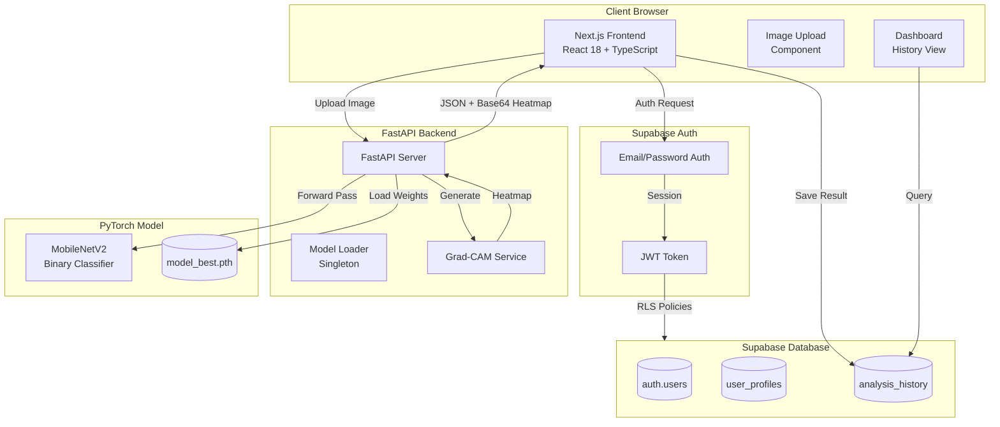
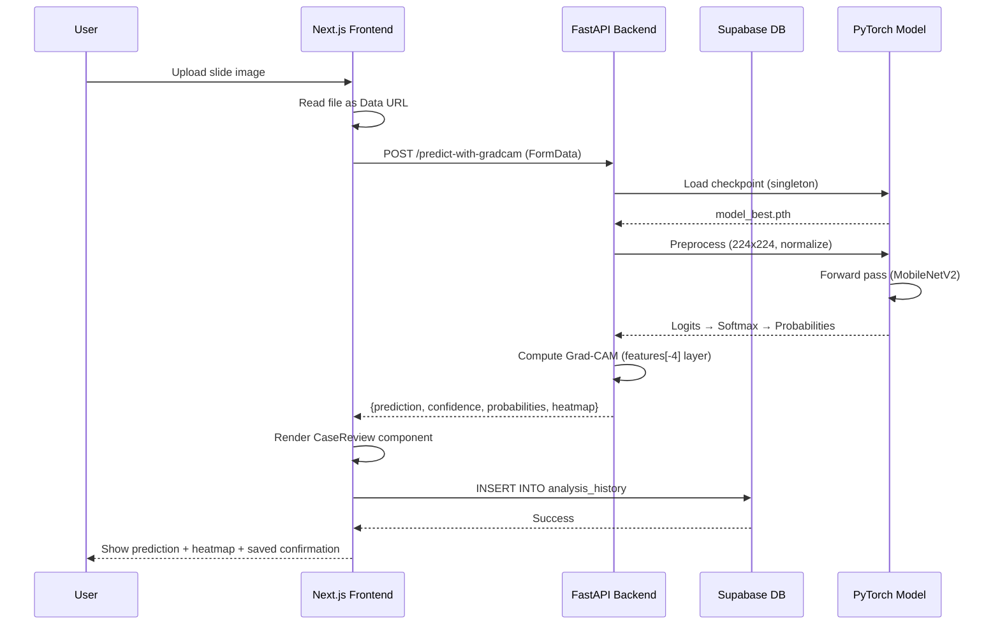

<div align="center">

# HistoAI

**Explainable AI for histopathology image analysis**

A research and educational prototype that combines deep learning (MobileNetV2), Grad-CAM visual explanations, and a modern full-stack web interface for analyzing histopathology slides.

[](LICENSE)
[](https://www.python.org/)
[](https://nextjs.org/)
[](https://fastapi.tiangolo.com/)
[](https://supabase.com/)

</div>

---

## Table of Contents

- [Overview](#overview)
- [Features](#features)
- [Architecture](#architecture)
- [Technology Stack](#technology-stack)
- [Deep Dive: The Model](#deep-dive-the-model)
- [Deep Dive: Grad-CAM Explainability](#deep-dive-grad-cam-explainability)
- [Deep Dive: The Frontend](#deep-dive-the-frontend)
- [Deep Dive: Backend & Database](#deep-dive-backend--database)
- [Repository Structure](#repository-structure)
- [Getting Started](#getting-started)
- [Training Your Own Model](#training-your-own-model)
- [Design Philosophy](#design-philosophy)
- [Intended Use & Disclaimer](#intended-use--disclaimer)
- [Roadmap & Status](#roadmap--status)
- [Author](#author)

---

## Overview

HistoAI is a **student-built, end-to-end AI system** for binary classification of histopathology images (benign vs malignant). It demonstrates the full ML engineering lifecycle: from training a convolutional neural network on medical image data, through explainable AI (XAI) techniques, to deploying a production-grade web application with authentication, history tracking, and a polished user interface.

This is not just a Jupyter notebook demo. It is a **deployable system** with:
- A PyTorch inference service (FastAPI)
- A Next.js 14 App Router frontend with TypeScript
- Supabase (PostgreSQL + Auth + Row Level Security)
- Grad-CAM attention visualization
- Intended-use gating and research disclaimers

> **Important:** HistoAI is a research/educational tool. It is **not a medical device** and must not be used for clinical diagnosis. All outputs are model suggestions that require review by a qualified pathologist.

---

## Features

### Core Capabilities
- **Binary Classification:** Predicts benign or malignant from histopathology slide images
- **Confidence Scores:** Returns softmax probabilities for both classes
- **Grad-CAM Heatmaps:** Visualizes where the model "looked" to make its decision
- **Case History:** Saves every analysis to a personal dashboard with timestamps, confidence, and heatmaps

### User Experience
- **Minimal, clinical UI:** Light theme with medical green accents, designed for focus and trust
- **Responsive design:** Works on desktop and tablet
- **Real-time feedback:** Progress stages during analysis (upload → inference → Grad-CAM)
- **Guided onboarding:** Dedicated guide page and "Space for nerds" technical deep-dive page
- **Auth-gated:** Supabase email/password authentication with intended-use acceptance flow

### Engineering
- **Monorepo structure:** Frontend, backend, and model training in one repository
- **Idempotent SQL:** Safe, re-runnable Supabase setup scripts
- **Environment-based config:** Clear separation of dev/prod via `.env`
- **RLS Security:** Row Level Security ensures users only see their own data
- **No LLM assistant:** CNN is the sole source of predictions (removed Gemini integration for clarity and trust)

---

## Architecture

### High-Level System Diagram



### Request Flow (Upload → Result)



---

## Technology Stack

### Frontend
| Layer | Technology | Purpose |
|-------|-----------|---------|
| Framework | **Next.js 14** (App Router) | React meta-framework with server components |
| Language | **TypeScript** | Type safety across the entire UI |
| Styling | **Tailwind CSS v4** | Utility-first CSS with custom design tokens |
| UI Components | **Radix UI + shadcn/ui** | Accessible, unstyled primitives |
| Animations | **Framer Motion** | Smooth page transitions and micro-interactions |
| Background FX | **OGL** | WebGL shader-based "DarkVeil" background on homepage |
| Icons | **Lucide React** | Consistent icon set |
| Auth | **@supabase/ssr** | Server-side Supabase auth helpers |
| HTTP Client | **Axios** | API calls to FastAPI backend |

### Backend
| Layer | Technology | Purpose |
|-------|-----------|---------|
| Framework | **FastAPI 0.104** | Async Python web framework |
| Server | **Uvicorn** | ASGI server |
| ML Runtime | **PyTorch 2.1** | Deep learning framework |
| Model Arch | **TorchVision MobileNetV2** | Pretrained CNN backbone |
| Image Processing | **Pillow + OpenCV** | Image loading, preprocessing, heatmap overlay |
| Numerical | **NumPy** | Array operations for Grad-CAM |

### Database & Auth
| Layer | Technology | Purpose |
|-------|-----------|---------|
| Database | **Supabase (PostgreSQL)** | Managed Postgres with real-time capabilities |
| Auth | **Supabase Auth** | Email/password authentication |
| Security | **Row Level Security (RLS)** | Policies ensure users only access their own data |
| ORM/Client | **@supabase/supabase-js** | JavaScript client for DB and auth |

### Model Training
| Layer | Technology | Purpose |
|-------|-----------|---------|
| Framework | **PyTorch 2.1** | Training loop, checkpointing |
| Data Loading | **TorchVision Datasets/DataLoaders** | Custom Dataset for histopathology slides |
| Augmentation | **TorchVision Transforms** | Random horizontal flip, normalization |
| Metrics | **scikit-learn** | Accuracy, F1, AUC-ROC |
| Progress | **tqdm** | Training progress bars |

### DevOps & Tooling
| Layer | Technology | Purpose |
|-------|-----------|---------|
| Monorepo | **Git** | Single repository for all components |
| Package Manager | **npm** (frontend), **pip** (backend/model) | Dependency management |
| Environment | **dotenv (.env.local)** | Environment variable management |
| Linting | **ESLint** (Next.js config) | Frontend code quality |
| Type Checking | **TypeScript** | Compile-time type safety |

---

## Deep Dive: The Model

### Architecture: MobileNetV2

HistoAI uses **MobileNetV2** as the backbone CNN architecture. MobileNetV2 is a lightweight, efficient convolutional neural network designed for mobile and edge devices. It uses **inverted residual blocks** with **linear bottlenecks**, making it fast and memory-efficient while maintaining good accuracy.

**Why MobileNetV2?**
- **Efficiency:** ~3.4M parameters (vs ~25M for ResNet50), fast inference on CPU
- **Proven performance:** Strong results on medical imaging tasks
- **Pretrained weights:** Transfer learning from ImageNet accelerates convergence
- **Deployability:** Small footprint makes it suitable for local inference without GPU

### Model Head

The pretrained MobileNetV2 classifier is replaced with a custom binary classification head:

```python
model.classifier = nn.Sequential(
    nn.Dropout(0.2),
    nn.Linear(model.last_channel, 2)  # 2 classes: benign, malignant
)
```

- **Dropout (0.2):** Regularization to prevent overfitting
- **Linear layer:** Maps the 1280-dimensional feature vector to 2 output logits

### Input Preprocessing

All images (training and inference) undergo the following preprocessing:

1. **Resize:** 224×224 pixels (MobileNetV2 input size)
2. **ToTensor:** Convert PIL Image to PyTorch tensor (0-1 range)
3. **Normalize:** ImageNet normalization
   - Mean: `[0.485, 0.456, 0.406]`
   - Std: `[0.229, 0.224, 0.225]`

### Training Dataset

The model was trained on a **breast histopathology dataset** with the following class distribution:

| Class | Count | Percentage |
|-------|-------|------------|
| Benign | 1,013 | ~16% |
| Malignant | 5,429 | ~84% |
| **Total** | **6,442** | **100%** |

**Class imbalance handling:**
- Initially used weighted CrossEntropyLoss (weights inversely proportional to class frequency)
- Final version uses standard CrossEntropyLoss (see `model/src/model/train.py`)

### Training Procedure

- **Optimizer:** Adam (learning rate = 0.001)
- **Scheduler:** StepLR (step_size=7, gamma=0.1) — reduces LR by 10× every 7 epochs
- **Loss:** CrossEntropyLoss
- **Batch size:** 32
- **Epochs:** 15 (default)
- **Augmentation:** Random horizontal flip (50% probability)
- **Validation split:** 80/20 train/val split with fixed random seed (42)

### Checkpointing

The training script saves the best model (highest validation accuracy) to `model/models/model_best.pth`. The backend loads this checkpoint on startup using a singleton pattern (`model_loader.get_model()`).

### Inference Pipeline

```python
# 1. Load image
image = Image.open(io.BytesIO(image_data)).convert("RGB")

# 2. Preprocess
tensor = transform(image).unsqueeze(0)  # (1, 3, 224, 224)

# 3. Forward pass
with torch.no_grad():
    outputs = model(tensor)
    probs = torch.nn.functional.softmax(outputs, dim=1)
    confidence, predicted = torch.max(probs, 1)

# 4. Map to labels
prediction = "malignant" if predicted.item() == 1 else "benign"
```

---

## Deep Dive: Grad-CAM Explainability

### What is Grad-CAM?

**Grad-CAM (Gradient-weighted Class Activation Mapping)** is a technique for visualizing which regions of an image a CNN "looked at" to make its prediction. It produces a coarse localization map highlighting the important regions.

### How It Works (Mathematically)

For a target class \( c \):

1. **Forward pass:** Get activations \( A^k \) from a target convolutional layer (usually the last conv layer)
2. **Backward pass:** Compute gradients of the class score \( y^c \) with respect to activations: \( \frac{\partial y^c}{\partial A^k} \)
3. **Global average pooling:** Compute importance weights:

   \[
   \alpha_k^c = \frac{1}{Z} \sum_i \sum_j \frac{\partial y^c}{\partial A^k_{ij}}
   \]

4. **Weighted combination:** Compute the Grad-CAM heatmap:

   \[
   L_{Grad-CAM}^c = ReLU\left(\sum_k \alpha_k^c A^k\right)
   \]

5. **Upsample:** Bilinear interpolation to match input image size (224×224)
6. **Normalize:** Scale to [0, 1]

### Implementation Details

**Target layer selection:**
- For MobileNetV2: `model.features[-4]` (a deep convolutional block)
- For ResNet: `model.layer4[-1]`
- Fallback: Last `Conv2d` layer found via traversal

**Hooks:**
- Forward hook captures activations
- Backward hook captures gradients
- Both are removed after computation to avoid memory leaks

**Overlay:**
- Heatmap is colorized using OpenCV's `COLORMAP_JET`
- Overlaid on the original image with alpha blending (0.4 heatmap, 0.6 original)

### Why Grad-CAM Matters

- **Trust:** Users can see *why* the model made a prediction
- **Debugging:** Helps identify if the model is focusing on relevant tissue regions or artifacts
- **Education:** Teaches students and researchers how CNNs make decisions

**Important caveat:** Grad-CAM shows **model attention**, not proof of disease. A heatmap highlighting a region does not mean that region is cancerous — it means the model used that region for its prediction.

---

## Deep Dive: The Frontend

### Next.js 14 App Router

The frontend uses the **App Router** (introduced in Next.js 13), which provides:
- **Server Components:** Default for static content (better performance)
- **Client Components:** Explicitly marked with `"use client"` for interactivity
- **File-based routing:** `app/dashboard/page.tsx` → `/dashboard`
- **Layouts:** Shared UI (e.g., `app/layout.tsx` includes global footer)

### Design System

The UI uses a **custom design token system** defined in `app/globals.css`:

**Color tokens (OKLCH color space):**
- `--primary`: Medical green (`oklch(0.52 0.15 142)`) — used for CTAs, accents
- `--page-wash`: Subtle gradient background (`oklch(0.98 0.015 150)`)
- `--panel`: Pure white cards/panels
- `--border-subtle`: Light border color for minimal separation
- `--malignant`: Deep rose for malignant predictions (not alarming red)
- `--benign`: Same green as primary (consistent, calm)

**Typography:**
- **Display font:** Space Grotesk (headings, hero text)
- **Body font:** DM Sans (readable, modern)

**Utility classes:**
- `.rounded-panel`: 1.25rem border radius for cards
- `.panel-shadow`: Soft shadow for depth
- `.bg-page-wash`: Gradient background for pages

### Key Pages

| Route | Purpose | Key Components |
|-------|---------|----------------|
| `/` | Homepage with hero, "How it works", intended use | `MarketingHeader`, `DarkVeil`, `Logo` |
| `/guide` | User onboarding guide (what, how, why) | Static content, icons |
| `/nerds` | Technical deep-dive (model, pipeline, decisions) | Static content, code snippets |
| `/auth/login` | Supabase email/password login | `LoginForm` |
| `/auth/sign-up` | User registration | `SignUpForm` |
| `/analyze` | Upload image, run inference, view results | `SimpleImageUpload`, `CaseReview`, `IntendedUseGate` |
| `/dashboard` | View analysis history, open past cases | `HistoryCard`, `HistoryDetailModal`, `AppHeader` |

### State Management

- **Local state:** React `useState` for UI state (loading, results, errors)
- **Server state:** Supabase client for auth and database queries
- **No global state library:** Kept simple with prop drilling and composition

### Supabase Integration

**Client-side (browser):**
```typescript
import { createClient } from "@/lib/supabase/client"
const supabase = createClient()
const { data, error } = await supabase.from("analysis_history").select("*")
```

**Server-side (middleware):**
- `lib/supabase/middleware.ts` checks auth on every request
- Redirects unauthenticated users from `/dashboard` and `/analyze` to `/auth/login`
- Redirects authenticated users away from auth pages

### Intended Use Gate

Before running an analysis, users must accept the intended-use terms:
- Stored in `user_profiles.intended_use_accepted_at` (Supabase)
- `IntendedUseGate` component blocks the upload UI until accepted
- Persisted across sessions

---

## Deep Dive: Backend & Database

### FastAPI Backend

**Endpoints:**

| Method | Path | Purpose |
|--------|------|---------|
| GET | `/` | Health check (returns "HistoAI Backend is running") |
| GET | `/health` | Model health check (returns `{"status": "healthy", "model_loaded": true}`) |
| POST | `/predict` | Standard prediction (no Grad-CAM) |
| POST | `/predict-with-gradcam` | Prediction + Grad-CAM heatmap (main endpoint) |

**Model loading:**
- Singleton pattern: `model_loader.get_model()` loads the checkpoint once on startup
- Searches for `model_best.pth` or `best_model.pth` in multiple paths (CWD, `models/`, `../model/models/`)
- Loads checkpoint dict, extracts `model_state_dict`, sets model to `eval()` mode

**CORS:**
- Currently allows all origins (`allow_origins=["*"]`) — fine for local dev, should be restricted in production

### Supabase Database Schema

**Table: `analysis_history`**

| Column | Type | Description |
|--------|------|-------------|
| `id` | UUID (PK) | Auto-generated primary key |
| `user_id` | UUID (FK) | References `auth.users(id)` ON DELETE CASCADE |
| `image_url` | TEXT | Base64 data URL of uploaded image |
| `prediction` | TEXT | "benign" or "malignant" |
| `confidence` | DECIMAL(5,4) | Softmax probability (0-1) |
| `probabilities` | JSONB | `{"benign": 0.23, "malignant": 0.77}` |
| `heatmap` | TEXT | Base64 data URL of Grad-CAM overlay |
| `heatmap_url` | TEXT | Future: storage path (currently unused) |
| `processing_time` | INTEGER | Milliseconds from upload to result |
| `created_at` | TIMESTAMP | Auto-set to CURRENT_TIMESTAMP |

**Table: `user_profiles`**

| Column | Type | Description |
|--------|------|-------------|
| `user_id` | UUID (PK, FK) | References `auth.users(id)` ON DELETE CASCADE |
| `intended_use_accepted_at` | TIMESTAMP | When user accepted intended-use terms |
| `created_at` | TIMESTAMP | Auto-set |
| `updated_at` | TIMESTAMP | Auto-updated on upsert |

### Row Level Security (RLS)

All tables have RLS enabled with policies:

**`analysis_history` policies:**
- Users can `SELECT` their own rows: `USING (auth.uid() = user_id)`
- Users can `INSERT` their own rows: `WITH CHECK (auth.uid() = user_id)`
- Users can `UPDATE` their own rows: `USING (auth.uid() = user_id) WITH CHECK (auth.uid() = user_id)`
- Users can `DELETE` their own rows: `USING (auth.uid() = user_id)`

**`user_profiles` policies:**
- Same pattern: users can only view/insert/update their own profile

**Why RLS matters:**
- Even if the frontend is compromised, the database enforces access control
- No need for backend API keys or custom auth logic — Supabase handles it
- Users cannot see or modify other users' data, period

### SQL Setup

The `frontend/scripts/setup_supabase.sql` script is **idempotent** (safe to run multiple times):
- Creates tables if they don't exist (`CREATE TABLE IF NOT EXISTS`)
- Adds columns if they don't exist (`ADD COLUMN IF NOT EXISTS`)
- Drops and recreates policies (`DROP POLICY IF EXISTS` + `CREATE POLICY`)
- Creates indexes (`CREATE INDEX IF NOT EXISTS`)

---

## Repository Structure

```
histoai/
├── frontend/                 # Next.js 14 frontend
│   ├── app/                  # App Router pages
│   │   ├── page.tsx          # Homepage
│   │   ├── layout.tsx        # Root layout (includes SiteFooter)
│   │   ├── globals.css       # Design tokens + Tailwind
│   │   ├── dashboard/        # Dashboard page
│   │   ├── analyze/          # Analyze page
│   │   ├── guide/            # Guide page
│   │   ├── nerds/            # Technical deep-dive page
│   │   └── auth/             # Auth pages (login, sign-up)
│   ├── components/           # React components
│   │   ├── layout/           # Header, footer, marketing header
│   │   ├── brand/            # Logo component
│   │   ├── case/             # CaseReview component (prediction + Grad-CAM)
│   │   ├── ui/               # shadcn/ui components (Button, Alert, Dialog, etc.)
│   │   ├── HistoryCard.tsx   # Dashboard history card
│   │   ├── HistoryDetailModal.tsx  # Case review popup
│   │   ├── simple-image-upload.tsx # Image upload with progress
│   │   ├── intended-use-gate.tsx   # Intended-use acceptance gate
│   │   └── research-disclaimer.tsx # Disclaimer banner
│   ├── lib/                  # Utilities
│   │   ├── supabase/         # Supabase client, server, middleware
│   │   └── utils.ts          # cn() helper for classnames
│   ├── services/             # API clients
│   │   └── unified-api.ts    # FastAPI backend client
│   ├── types/                # TypeScript types
│   │   └── analysis.ts       # HistoryAnalysis, AnalysisHistoryInsert
│   ├── scripts/              # SQL setup scripts
│   │   ├── 001_create_tables.sql
│   │   ├── 002_align_analysis_history.sql
│   │   └── setup_supabase.sql      # One-shot idempotent setup
│   ├── .env.example          # Environment variable template
│   ├── .env.local            # Local environment (gitignored)
│   ├── package.json          # npm dependencies
│   ├── next.config.mjs       # Next.js config
│   └── tsconfig.json         # TypeScript config
│
├── backend/                  # FastAPI backend
│   ├── app.py                # FastAPI app, endpoints
│   ├── run_server.py         # Uvicorn server launcher
│   ├── requirements.txt      # Python dependencies
│   ├── src/
│   │   └── model/            # Model code
│   │       ├── model.py      # Model architecture (MobileNetV2 head)
│   │       ├── model_loader.py   # Singleton loader, preprocessing
│   │       └── gradcam_service.py # Grad-CAM computation + overlay
│   └── models/               # Model checkpoints (gitignored)
│       └── model_best.pth    # Trained MobileNetV2 weights
│
├── model/                    # Model training workspace
│   ├── scripts/
│   │   ├── train.py          # Training script (CLI)
│   │   └── generate_gradcam.py  # Standalone Grad-CAM generator
│   ├── src/
│   │   └── model/            # Same structure as backend/src/model
│   │       ├── dataset.py    # HistopathDataset, DataLoaders
│   │       ├── model.py      # Model architecture
│   │       ├── train.py      # Training loop
│   │       └── utils.py      # Checkpoint save/load
│   ├── data/                 # Training data (gitignored)
│   └── models/               # Saved checkpoints (gitignored)
│
├── docs/                     # Documentation
│   ├── INTENDED_USE.md       # Intended use statement (research-only)
│   ├── LOCAL_SETUP.md        # Local development setup guide
│   ├── REPOSITORY_MAP.md     # Code navigation guide
│   └── DASHBOARD_OVERVIEW.md # Dashboard design notes
│
├── IMPROVEMENTS.md           # Phased improvement plan (P0-P3)
├── SYSTEM_ARCHITECTURE.md    # High-level architecture notes
├── ROADMAP.md                # Historical planning (see IMPROVEMENTS.md)
├── DEPENDENCY_REPORT.md      # Dependency audit
├── DESIGN_IMPROVEMENTS.md    # Design system notes
├── README.md                 # This file
└── LICENSE                   # MIT License
```

---

## Getting Started

### Prerequisites

- **Node.js** 18+ and **npm**
- **Python** 3.10+ and **pip**
- **Supabase account** (free tier works)
- **Trained model checkpoint** (`model_best.pth`) — see [Training Your Own Model](#training-your-own-model)

### 1. Clone the Repository

```bash
git clone https://github.com/maybeswayam/Histopathology-FullRepo.git
cd Histopathology-FullRepo
```

### 2. Set Up Supabase

1. Create a new project at [supabase.com](https://supabase.com)
2. Go to **SQL Editor** → **New query**
3. Copy the contents of `frontend/scripts/setup_supabase.sql` and run it
4. Go to **Project Settings** → **API** and copy:
   - Project URL
   - Anon (public) key

### 3. Configure Frontend Environment

Create `frontend/.env.local`:

```env
NEXT_PUBLIC_SUPABASE_URL=https://your-project-ref.supabase.co
NEXT_PUBLIC_SUPABASE_ANON_KEY=your-anon-key-here
NEXT_PUBLIC_BACKEND_URL=http://localhost:8000
NEXT_PUBLIC_AUTH_BYPASS=false
```

### 4. Install Frontend Dependencies

```bash
cd frontend
npm install
```

### 5. Install Backend Dependencies

```bash
cd backend
pip install -r requirements.txt
```

### 6. Place Model Checkpoint

Place your trained `model_best.pth` in one of:
- `backend/models/`
- `model/models/`

### 7. Start Backend

```bash
cd backend
python run_server.py
```

Backend runs on `http://localhost:8000`. Check health at `http://localhost:8000/health`.

### 8. Start Frontend

```bash
cd frontend
npm run dev
```

Frontend runs on `http://localhost:3000`.

### 9. Use the App

1. Go to `http://localhost:3000`
2. Click **Get started** → Sign up with email/password
3. Accept intended-use terms
4. Go to **Analyze** → Upload a histopathology slide (PNG/JPG)
5. View prediction, confidence, and Grad-CAM heatmap
6. Check **Dashboard** to see your analysis history

---

## Training Your Own Model

### Dataset Structure

Organize your histopathology images in the following structure:

```
model/data/
├── BREAST_ADENOSIS/          # Benign
├── BREAST_FIBRODENOMA/       # Benign
├── BREAST_PYLLODES_TUMOR/    # Benign
├── BREAST_TUBULAR_ADENOMA/   # Benign
├── BREAST_DUCTAL_CARCINOMA/  # Malignant
├── BREAST_LOBULAR_CARCINOMA/ # Malignant
├── BREAST_MUCINOUS_CARCINOMA/ # Malignant
└── BREAST_PAPILLARY_CARCINOMA/ # Malignant
```

The `dataset.py` script maps these folders to binary labels (0 = benign, 1 = malignant).

### Train

```bash
cd model
python scripts/train.py --data_dir data --epochs 15 --batch_size 32 --lr 0.001 --pretrained
```

**Arguments:**
- `--data_dir`: Path to dataset root (default: `data`)
- `--arch`: Architecture (`mobilenet_v2`, `resnet18`, `resnet50`, `efficientnet_b0`)
- `--epochs`: Number of epochs (default: 15)
- `--batch_size`: Batch size (default: 32)
- `--lr`: Learning rate (default: 0.001)
- `--pretrained`: Use ImageNet pretrained weights (recommended)
- `--resume`: Resume from checkpoint
- `--seed`: Random seed (default: 42)

### Output

- Checkpoints saved to `model/models/`
- Best model (highest validation accuracy) saved as `model_best.pth`
- Training logs printed to console (loss, accuracy, F1, AUC per epoch)

### Generate Grad-CAM Standalone

```bash
cd model
python scripts/generate_gradcam.py --image path/to/slide.png --checkpoint models/model_best.pth
```

Outputs a PNG with the Grad-CAM overlay.

---

## Design Philosophy

### Minimalism

- **Calm, clinical aesthetic:** Light theme, subtle borders, no heavy shadows or gradients
- **Purposeful color:** Medical green for primary actions, muted rose for malignant predictions
- **Whitespace:** Generous padding and spacing to reduce cognitive load

### Trust

- **Intended-use gate:** Forces users to acknowledge research-only nature before first use
- **Disclaimer banner:** Persistent reminder on every page
- **Grad-CAM:** Transparency into model decisions
- **No hype:** Copy avoids overpromising ("model suggestion", not "diagnosis")

### Cohesion

- **Design tokens:** Single source of truth in `globals.css` (OKLCH colors, radii, shadows)
- **Typography:** Space Grotesk for display, DM Sans for body
- **Component reuse:** `CaseReview` used on both `/analyze` and dashboard popup
- **Consistent interactions:** Framer Motion for smooth, predictable animations

---

## Intended Use & Disclaimer

**HistoAI is a research and educational prototype. It is not a medical device.**

- Predictions are model outputs that can be wrong
- Grad-CAM heatmaps show model attention, not proof of disease
- Clinical decisions require a qualified pathologist
- Do not use HistoAI to diagnose, treat, or manage patients

Full statement: [docs/INTENDED_USE.md](docs/INTENDED_USE.md)

---

## Roadmap & Status

### Current Status (Phase A Complete)

- ✅ Supabase auth + RLS
- ✅ Analysis history with Grad-CAM
- ✅ Intended-use gate
- ✅ Removed Gemini LLM assistant (CNN is sole prediction path)
- ✅ Minimal, cohesive UI redesign
- ✅ Comprehensive documentation

### Next Phases (see IMPROVEMENTS.md)

- **Phase B:** Storage optimization (move images/heatmaps to Supabase Storage, not base64 in DB)
- **Phase C:** Testing (unit tests for model, integration tests for API, E2E for frontend)
- **Phase D:** Deployment (Docker, CI/CD, production Supabase config)

---

## Author

**Swayam Adhana**

- GitHub: [@maybeswayam](https://github.com/maybeswayam)
- LinkedIn: [Swayam Adhana](https://www.linkedin.com/in/swayam-adhana-01b2b2293/)
- Portfolio: [swayamm-portfolioo.vercel.app](https://swayamm-portfolioo.vercel.app/)

B.Tech student focused on Machine Learning, backend engineering, and real-world deployments.

---

## License

MIT License — see [LICENSE](LICENSE) for details.

---

<div align="center">

**Built with curiosity, caffeine, and a commitment to explainable AI.**

</div>
