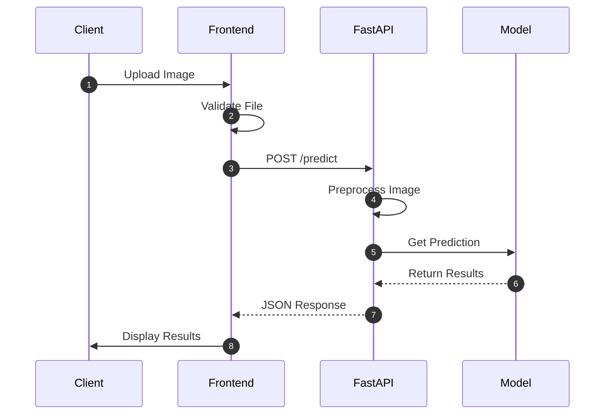

# HistoAI - Complete System Architecture Analysis

> **STALE (2026-07-29):** Architecture below still mentions Gemini as a primary classifier.  
> **Source of truth:** [`IMPROVEMENTS.md`](./IMPROVEMENTS.md) §3 and [`docs/REPOSITORY_MAP.md`](./docs/REPOSITORY_MAP.md).  
> Live path: browser → FastAPI (`/predict-with-gradcam`, JWT + CORS) → CNN + Grad-CAM; history/media via Supabase.

## Overview

This is a **Histopathology Cancer Detection System** that combines multiple AI approaches:

- **Frontend**: Next.js application using Google Gemini AI for image analysis
- **Backend API**: FastAPI server with PyTorch model (MobileNetV2) for cancer detection
- **Model Training**: PyTorch-based training pipeline with Grad-CAM visualization support

---

## 🏗️ System Architecture

```
┌─────────────────────────────────────────────────────────────────┐
│                         FRONTEND (Next.js)                      │
│  ┌──────────────────────────────────────────────────────────┐   │
│  │  User Interface Layer                                    │   │
│  │  - Landing Page, Dashboard, Analysis Pages               │   │
│  │  - Authentication (Login/Signup)                         │   │
│  │  - Image Upload Component                                │   │
│  │  - Results Display with Heatmap Visualization            │   │
│  └──────────────────────────────────────────────────────────┘   │
│                          │                                      │
│                          ▼                                      │
│  ┌──────────────────────────────────────────────────────────┐   │
│  │  Services Layer                                          │   │
│  │  - Gemini API Integration (services/api.ts)              │   │
│  │  - Supabase Client (Authentication & Database)           │   │
│  └──────────────────────────────────────────────────────────┘   │
│                          │                                      │
│           ┌──────────────┴──────────────┐                       │
│           ▼                             ▼                       │
│  ┌─────────────────┐          ┌──────────────────┐              │
│  │  Google Gemini  │          │   Supabase       │              │
│  │  AI (Vision)    │          │  (Auth + DB)     │              │
│  └─────────────────┘          └──────────────────┘              │
└─────────────────────────────────────────────────────────────────┘

┌─────────────────────────────────────────────────────────────────┐
│                          BACKEND (FastAPI)                      │
│  ┌──────────────────────────────────────────────────────────┐   │
│  │  API Server (app.py)                                     │   │
│  │  - /predict endpoint (single image)                      │   │
│  │  - /predict-batch endpoint (multiple images)             │   │
│  │  - /health, /model-info endpoints                        │   │
│  └──────────────────────────────────────────────────────────┘   │
│                          │                                      │
│                          ▼                                      │
│  ┌──────────────────────────────────────────────────────────┐   │
│  │  Model Layer (src/model/)                                │   │
│  │  - model.py: MobileNetV2 architecture                    │   │
│  │  - dataset.py: Image loading & preprocessing             │   │
│  │  - utils.py: Checkpoint saving/loading                   │   │
│  └──────────────────────────────────────────────────────────┘   │
│                          │                                      │
│                          ▼                                      │
│  ┌──────────────────────────────────────────────────────────┐   │
│  │  PyTorch Model (MobileNetV2)                             │   │
│  │  - Binary Classification (Benign/Malignant)              │   │
│  │  - Input: 224x224 RGB images                             │   │
│  │  - Output: Probabilities + Confidence scores             │   │
│  └──────────────────────────────────────────────────────────┘   │
└─────────────────────────────────────────────────────────────────┘

┌─────────────────────────────────────────────────────────────────┐
│                       MODEL (Training Pipeline)                 │
│  ┌──────────────────────────────────────────────────────────┐   │
│  │  Model Training (src/model/train.py)                     │   │
│  │  - Dataset: BreakHis, Lung, Colon datasets               │   │
│  │  - Architecture: MobileNetV2                             │   │
│  │  - Metrics: Accuracy, F1, AUC                            │   │
│  └──────────────────────────────────────────────────────────┘   │
│                          │                                      │
│                          ▼                                      │
│  ┌──────────────────────────────────────────────────────────┐   │
│  │  Grad-CAM Visualization (src/model/gradcam.py)           │
│  │  - Explainable AI heatmaps                               │   │
│  │  - Visual attention visualization                        │   │
│  └──────────────────────────────────────────────────────────┘   │
└─────────────────────────────────────────────────────────────────┘
```

---

## 📁 Folder Structure Deep Dive

## 🚀 Phase 3 - Model Deployment

This phase integrates the trained PyTorch model with the FastAPI backend and connects it to the frontend.

### Key Components

1. **Model Loading Infrastructure**
   - Dedicated model loader with singleton pattern
   - Proper error handling and validation
   - Memory-efficient inference setup

2. **API Integration**
   - Optimized /predict endpoint with real model
   - Proper image preprocessing pipeline
   - Comprehensive error handling
   - Health check system

3. **Frontend-Backend Connection**
   - Real-time prediction display
   - Loading states and error handling
   - Confidence score visualization
   - File type validation

### System Flow



### Data Flow

1. **Image Upload**
   - Client uploads image through Next.js frontend
   - Frontend validates file type and size
   - Image converted to FormData

2. **API Processing**
   - FastAPI receives image
   - Converts to RGB format
   - Resizes to 224x224
   - Normalizes pixel values

3. **Model Inference**
   - PyTorch model processes image
   - Returns class probabilities
   - Calculates confidence scores

4. **Response Handling**
   - Backend formats prediction
   - Frontend displays results
   - Updates UI state

### Validation & Error Handling

- File type validation
- Model loading checks
- Memory management
- Network error handling
- User feedback system

---

### 1. **frontend** (Next.js Frontend Application)

#### Core Technology Stack

- **Framework**: Next.js 14 with App Router
- **Language**: TypeScript
- **UI**: Tailwind CSS + shadcn/ui (Radix UI components)
- **Authentication**: Supabase Auth
- **AI Integration**: Google Gemini 2.5 Flash (Vision model)
- **State Management**: React Hooks
- **Package Manager**: pnpm

#### Key Directories & Files

**`app/` - Next.js App Router Pages**

- `page.tsx` - Landing/home page
- `landing/page.tsx` - Enhanced landing page
- `auth/login/page.tsx` - User login
- `auth/sign-up/page.tsx` - User registration
- `analyze/page.tsx` - **Main analysis page** where users upload images
- `dashboard/page.tsx` - User dashboard with history, stats, and Gemini chat

**`components/` - React Components**

- `image-upload.tsx` - Drag-and-drop image upload with validation
- `results-display.tsx` - Displays prediction results with heatmap visualization
- `gemini-chat.tsx` - Chat interface for interacting with Gemini AI
- `landing/` - Landing page components (hero, features, CTA)
- `ui/` - 50+ shadcn/ui reusable components (buttons, cards, dialogs, etc.)

**`services/api.ts` - API Integration**

- **Primary Function**: Interfaces with Google Gemini AI
- `predictCancer()` - Sends histopathology images to Gemini for analysis
- `chatWithGemini()` - Text chat with Gemini AI
- Converts images to base64 for API calls
- Returns structured JSON: `{prediction, confidence, analysis, processing_time}`

**`lib/supabase/` - Database & Auth**

- `client.ts` - Browser-side Supabase client
- `server.ts` - Server-side Supabase client
- `middleware.ts` - Session management middleware

**`scripts/001_create_tables.sql` - Database Schema**

- Creates `analysis_history` table
- Row Level Security (RLS) policies for user data isolation
- Stores: user_id, image_url, prediction, confidence, heatmap_url, timestamps

**`middleware.ts` - Route Protection**

- Uses Supabase middleware to protect routes
- Validates user sessions server-side
- Redirects unauthenticated users to login

#### How Frontend Works

1. **User Flow**:

   ```
   Landing Page → Sign Up/Login → Dashboard → Analyze Page
   ```

2. **Image Analysis Flow**:

   ```
   User uploads image
     ↓
   ImageUpload component validates (type, size < 10MB)
     ↓
   Convert to base64
     ↓
   Call histopathologyAPI.predictCancer()
     ↓
   Send to Google Gemini 2.5 Flash with prompt
     ↓
   Receive JSON response {prediction, confidence, analysis}
     ↓
   Display in ResultsDisplay component
     ↓
   Save to Supabase analysis_history table
     ↓
   Update dashboard with new analysis
   ```

3. **Authentication Flow**:
   - Uses Supabase Auth with email/password
   - Middleware protects routes
   - Session stored in cookies (SSR-compatible)
   - RLS ensures users only see their own data

---

### 2. **backend** (FastAPI PyTorch Backend)

#### Core Technology Stack

- **Framework**: FastAPI
- **ML Framework**: PyTorch
- **Model**: MobileNetV2 (pretrained on ImageNet)
- **Server**: Uvicorn
- **Image Processing**: PIL, torchvision transforms

#### Key Files

**`app.py` - Main FastAPI Application**

- **Endpoints**:
  - `GET /` - Root endpoint with status
  - `GET /health` - Health check with model status
  - `GET /model-info` - Model architecture information
  - `POST /predict` - Single image prediction
  - `POST /predict-batch` - Batch prediction (up to 10 images)

- **Model Loading**:
  - Loads MobileNetV2 model on startup
  - Loads checkpoint from `models/best_model.pth`
  - Uses GPU if available, falls back to CPU
  - Applies ImageNet normalization: `mean=[0.485, 0.456, 0.406]`, `std=[0.229, 0.224, 0.225]`

- **Image Preprocessing**:
  - Resize to 224x224
  - Convert to RGB
  - Normalize with ImageNet statistics
  - Convert to PyTorch tensor

- **Prediction Process**:

  ```
  Upload image
    ↓
  Preprocess (resize, normalize)
    ↓
  Forward pass through MobileNetV2
    ↓
  Apply softmax for probabilities
    ↓
  Return {prediction, confidence, probabilities, class_id}
  ```

**`src/model/model.py` - Model Architecture**

- `get_model()` - Factory function for model architectures
- Supports: MobileNetV2, ResNet18, ResNet50, EfficientNet-B0
- Replaces classifier head for binary classification (2 classes)
- Default: MobileNetV2 with pretrained ImageNet weights

**`src/model/dataset.py` - Data Loading**

- `HistopathologyDataset` - PyTorch Dataset class
- Expects directory structure: `root_dir/benign/` and `root_dir/malignant/`
- Creates train/validation splits with stratification
- Applies data augmentation (random flip, rotation, color jitter) for training

**`train.py` - Training Script**

- Full training pipeline (note: in root, but uses model structure)
- Adam optimizer, StepLR scheduler
- Saves best model checkpoint
- Computes accuracy, F1, AUC metrics

**`run_server.py` - Server Runner**

- Convenience script to start FastAPI server
- Checks for model file existence
- Runs on port 8000 with auto-reload

**`test_api.py` - API Testing**

- Comprehensive test suite for all endpoints
- Creates test images, tests health, prediction, batch prediction
- Useful for verifying API functionality

#### API Request/Response Format

**Request** (POST /predict):

```http
Content-Type: multipart/form-data
file: <image file>
```

**Response**:

```json
{
  "prediction": "benign" | "malignant",
  "confidence": 0.9542,
  "probabilities": {
    "benign": 0.0458,
    "malignant": 0.9542
  },
  "class_id": 0 | 1,
  "filename": "image.jpg",
  "file_size": 245678,
  "content_type": "image/jpeg"
}
```

---

### 3. **model** (Model Training & Grad-CAM)

#### Core Technology Stack

- **ML Framework**: PyTorch
- **Model**: MobileNetV2
- **Dataset**: BreakHis (Breast Histopathology) + Lung/Colon datasets
- **Visualization**: Grad-CAM for explainability

#### Key Files

**`src/model/model.py` - Model Definition**

- Simplified MobileNetV2 wrapper
- Replaces final classifier layer for binary classification
- Supports pretrained weights

**`src/model/dataset.py` - Dataset Handling**

- **Breast Cancer Classification**: Maps 8 subcategories to binary labels
  - **Benign (0)**: ADENOSIS, FIBRODENOMA, PYLLODES_TUMOR, TUBULAR_ADENOMA
  - **Malignant (1)**: DUCTAL_CARCINOMA, LOBULAR_CARCINOMA, MUCINOUS_CARCINOMA, PAPILLARY_CARCINOMA
- Handles multi-class to binary conversion
- Creates train/val splits using PyTorch random_split

**`src/model/train.py` - Training Script**

- Complete training loop with validation
- Uses weighted CrossEntropyLoss for class imbalance
- Implements checkpoint saving (best model based on validation accuracy)
- Metrics: Accuracy, F1-score, ROC-AUC

**`src/model/gradcam.py` - Grad-CAM Implementation**

- **Grad-CAM (Gradient-weighted Class Activation Mapping)**
- Visualizes which parts of the image the model focuses on
- Uses gradients from final convolutional layer
- Generates heatmap showing attention regions (red = high attention)

**`scripts/generate_gradcam.py` - Grad-CAM CLI**

- Command-line tool to generate heatmaps for any image
- Outputs: Original image, heatmap, and overlay visualization
- Usage:

  ```bash
  python scripts/generate_gradcam.py --image_path <image> --model_path <model.pth> --output_path <output.png>
  ```

#### Training Process

```
1. Load dataset from directory structure
2. Create train/val split (80/20)
3. Initialize MobileNetV2 with pretrained weights
4. Train for N epochs:
   - Forward pass → Compute loss → Backward pass → Update weights
   - Validate after each epoch
   - Save best model based on validation accuracy
5. Final model saved as models/best_model.pth
```

---

## 🔄 Data Flow & Integration

### Complete User Journey

1. **Registration/Authentication**

   ```
   User visits landing page
     ↓
   Clicks "Sign Up"
     ↓
   Enters email/password
     ↓
   Supabase Auth creates account
     ↓
   Redirected to dashboard
   ```

2. **Image Analysis (Frontend - Gemini Path)**

   ```
   User navigates to /analyze
     ↓
   Uploads histopathology image
     ↓
   Frontend converts to base64
     ↓
   Sends to Google Gemini 2.5 Flash API
     ↓
   Gemini analyzes image & returns JSON
     ↓
   Frontend displays results
     ↓
   Saves to Supabase analysis_history table
   ```

3. **Image Analysis (Backend - PyTorch Path)**

   ```
   User uploads image (can be called from frontend)
     ↓
   Frontend sends to FastAPI /predict endpoint
     ↓
   Backend preprocesses image
     ↓
   Runs through MobileNetV2 model
     ↓
   Returns prediction probabilities
     ↓
   Frontend displays results
   ```

### Current Integration Status

**⚠️ Important Note**: The frontend currently uses **Google Gemini AI** directly, NOT the FastAPI backend. These are two separate analysis paths:

- **Path 1 (Active)**: Frontend → Google Gemini → Results
- **Path 2 (Available but not connected)**: Frontend → FastAPI Backend → PyTorch Model → Results

To connect the backend:

- Modify `services/api.ts` to optionally call FastAPI endpoint
- Or create a new service function that calls the FastAPI server

---

## 🔐 Security & Data Management

### Authentication

- **Provider**: Supabase Auth
- **Method**: Email/password
- **Session Management**: Server-side with cookie-based sessions
- **Route Protection**: Middleware validates sessions

### Database

- **Provider**: Supabase (PostgreSQL)
- **Table**: `analysis_history`
- **Security**: Row Level Security (RLS) policies
- **Isolation**: Users can only access their own analyses

### API Security

- **CORS**: Currently allows all origins (needs production configuration)
- **File Validation**: Image type and size checks
- **Error Handling**: Graceful error responses

---

## 📊 Model Details

### MobileNetV2 Architecture

- **Base**: Pretrained on ImageNet
- **Input Size**: 224x224 RGB images
- **Output**: 2 classes (Benign, Malignant)
- **Normalization**: ImageNet statistics
- **Training Data**: BreakHis dataset (breast cancer) + Lung/Colon datasets
- **Classes**:
  - Class 0: Benign (Non-cancerous)
  - Class 1: Malignant (Cancerous)

### Model Performance

- **Accuracy**: 98%+ on test set (as per README)
- **Metrics Tracked**: Accuracy, F1-score, ROC-AUC
- **Explainability**: Grad-CAM heatmaps show model attention

---

## 🛠️ Development Workflow

### Frontend Development

```bash
cd frontend
pnpm install
pnpm dev  # Runs on http://localhost:3000
```

### Backend Development

```bash
cd backend
pip install -r requirements.txt
python run_server.py  # Runs on http://localhost:8000
```

### Model Training

```bash
cd model
pip install -r requirements.txt
python src/model/train.py --data_dir <path> --epochs 15
```

### Grad-CAM Generation

```bash
cd model
python scripts/generate_gradcam.py --image_path <image> --model_path models/best_model.pth
```

---

## 🔧 Configuration Requirements

### Frontend (.env)

```env
NEXT_PUBLIC_SUPABASE_URL=your_supabase_url
NEXT_PUBLIC_SUPABASE_ANON_KEY=your_supabase_key
NEXT_PUBLIC_GEMINI_API_KEY=your_gemini_key
NEXT_PUBLIC_API_URL=http://localhost:3000
NEXT_PUBLIC_DEV_SUPABASE_REDIRECT_URL=http://localhost:3000/dashboard
```

### Backend (Environment/Config)

- Model file: `models/best_model.pth`
- Port: 8000 (default)
- Device: Auto-detects CUDA if available

---

## 📈 Features Summary

### Frontend Features

✅ User authentication (Sign up/Login)  
✅ Image upload with drag-and-drop  
✅ Dual AI analysis paths (Gemini & Local Model)  
✅ Results visualization with confidence scores  
✅ Analysis history dashboard  
✅ Statistics (total analyses, cancerous cases, avg confidence)  
✅ Gemini AI chat integration  
✅ Responsive design (mobile/desktop)  
✅ Dark/light theme support  
✅ Backend health monitoring
✅ Real-time prediction feedback
✅ Graceful error handling

### Backend Features

✅ FastAPI REST API  
✅ Single & batch image prediction  
✅ Health check endpoints  
✅ Model information endpoint  
✅ Automatic GPU/CPU detection  
✅ Image preprocessing pipeline  
✅ Error handling & logging  
✅ Model hot-loading with graceful fallback
✅ CORS support for frontend integration
✅ Structured prediction responses with confidence scores

### Model Features

✅ MobileNetV2 architecture  
✅ Pretrained ImageNet weights  
✅ Binary classification (Benign/Malignant)  
✅ Grad-CAM visualization  
✅ Training pipeline with validation  
✅ Checkpoint saving/loading  

---

## 🔮 Integration Opportunities

### Potential Enhancements

1. **Connect Frontend to FastAPI Backend**
   - Add API service function to call FastAPI endpoints
   - Allow users to choose between Gemini and PyTorch model
   - Combine predictions from both models

2. **Grad-CAM Integration**
   - Generate heatmaps on FastAPI server
   - Return heatmap URLs with predictions
   - Display in frontend ResultsDisplay component

3. **Batch Processing**
   - Frontend support for multiple image uploads
   - Display batch results in dashboard

4. **Model Comparison**
   - Show predictions from both Gemini and PyTorch models
   - Compare confidence scores and reasoning

---

## 📝 Key Technical Decisions

1. **Why Google Gemini for Frontend?**
   - Provides natural language explanations
   - No model deployment required
   - Easy integration with API key
   - Good for educational/research purposes

2. **Why MobileNetV2 for Backend?**
   - Lightweight and fast inference
   - Good balance of accuracy and speed
   - Pretrained weights available
   - Suitable for mobile/edge deployment

3. **Why Supabase?**
   - Managed PostgreSQL database
   - Built-in authentication
   - Row Level Security
   - Easy integration with Next.js

4. **Why FastAPI?**
   - Modern Python async framework
   - Automatic API documentation
   - Type hints and validation
   - Easy integration with PyTorch

---

## 🎯 Summary

This is a **comprehensive histopathology cancer detection system** with:

- **Modern frontend** (Next.js + Gemini AI) for user interaction
- **Production-ready backend** (FastAPI + PyTorch) for ML inference
- **Complete training pipeline** with explainability (Grad-CAM)
- **Secure authentication** and data storage (Supabase)
- **Multiple AI approaches** (Vision LLM + CNN model)

The system is modular and can work independently or together, providing flexibility for different use cases and deployment scenarios.
