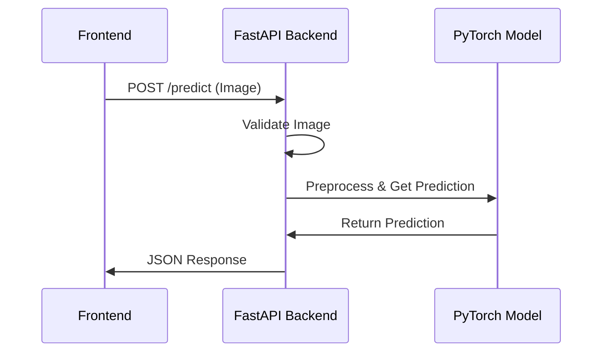

# Phase 3: Model Deployment and Full Pipeline Integration

This phase integrates the trained PyTorch model with the FastAPI backend and verifies end-to-end functionality with the frontend.

## 1. Implementation Summary

### Backend Updates

1. **Model Loading Infrastructure**
   - Created dedicated model loader module (`model_loader.py`)
   - Implemented singleton pattern for model instance management
   - Added proper error handling and validation

2. **FastAPI Integration**
   - Updated `/predict` endpoint to use trained model
   - Added proper image preprocessing
   - Implemented error handling and validation
   - Added health check and model info endpoints

3. **Model Verification**
   - Added `verify_model_load.py` script
   - Implemented model state validation
   - Added logging and diagnostics

## 2. System Flow Diagram



## 3. Technical Details

### Model Location
- Path: `backend/models/model_best.pth`
- Format: PyTorch state dict
- Input Size: 224x224 RGB
- Output: Binary classification (benign/malignant)

### API Endpoints

1. **POST /predict**
   ```json
   {
     "prediction": "benign|malignant",
     "confidence": 0.95,
     "probabilities": {
       "benign": 0.05,
       "malignant": 0.95
     },
     "file_info": {
       "filename": "sample.jpg",
       "size": 12345,
       "content_type": "image/jpeg"
     }
   }
   ```

2. **GET /health**
   ```json
   {
     "status": "healthy",
     "model_loaded": true
   }
   ```

### Frontend Integration
- Added real-time prediction display
- Improved error handling
- Added loading states
- Updated confidence score display

## 4. Model Retraining Instructions

To retrain the model:

1. **Prepare Environment**
   ```bash
   cd model
   pip install -r requirements.txt
   ```

2. **Run Training**
   ```bash
   python src/model/train.py
   ```

3. **Copy Model**
   ```bash
   cp models/best_model.pth ../backend/models/
   ```

## 5. Testing & Validation

1. **Model Loading**
   ```bash
   cd backend
   python verify_model_load.py
   ```

2. **API Testing**
   ```bash
   # Start server
   uvicorn app:app --reload
   
   # Test health
   curl http://localhost:8000/health
   
   # Test prediction (using sample image)
   curl -X POST -F "file=@samples/test.jpg" http://localhost:8000/predict
   ```

3. **Frontend Integration**
   ```bash
   cd frontend
   npm run dev
   ```

## 6. Error Handling

The system implements comprehensive error handling:

- Invalid file types
- Model loading failures
- Prediction errors
- Network connectivity issues
- Frontend display errors

## 7. Next Steps

1. **Performance Optimization**
   - Model quantization
   - Batch prediction support
   - Caching for frequent requests

2. **Monitoring**
   - Add telemetry
   - Performance metrics
   - Error tracking

3. **Security**
   - Input validation
   - Rate limiting
   - Authentication for sensitive endpoints
